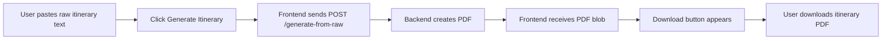

# Itinerary Generator Frontend (CST)


A lightweight frontend application that converts raw itinerary text into a polished downloadable PDF by sending the content to a backend generation API.

---

## ✨ Features

- Paste raw itinerary content in a large editor
- Generate a branded itinerary PDF in one click
- Download generated itinerary directly in browser
- Modal-based API settings for:
  - Backend API URL
  - Gemini API Key
  - Pexels API Key
- LocalStorage persistence for all settings
- Loading state, spinner, and inline error handling
- Light/Dark mode toggle

---

## 🧭 How It Works



---

## 🛠 Tech Stack

- **HTML5** for structure
- **CSS3** for styling, animations, and responsive layout
- **Vanilla JavaScript** for API communication and UI behavior
- **Google Fonts** (`Inter`, `Playfair Display`)
- **Browser LocalStorage** for runtime configuration

---

## 📁 Project Structure

```text
Itinerary-Generator-Frontend-CST/
├── index.html      # Main frontend application
├── page01.html     # Alternate/extended page variant
└── README.md
```

---

## 🚀 Getting Started

### 1) Clone the repository

```bash
git clone https://github.com/gihanpasindu1/Itinerary-Generator-Frontend-CST.git
cd Itinerary-Generator-Frontend-CST
```

### 2) Run locally

Because this is a static frontend, you can open the app directly:

- Open `index.html` in your browser  
**or**
- Use a simple local server (recommended):

```bash
python -m http.server 8080
```

Then visit: `http://localhost:8080`

---

## ⚙️ Configuration

Click the **settings icon** (top-right) and configure:

| Setting | Description | Stored As |
|---|---|---|
| Backend API URL | Endpoint used for itinerary generation | `backend_url` |
| Gemini API Key | Passed via request header | `gemini_key` |
| Pexels API Key | Passed via request header | `pexels_key` |

Default backend:

```text
https://travel-itinerary-system-graphical.onrender.com
```

---

## 📬 API Contract (Frontend → Backend)

### Request

- **Method:** `POST`
- **Endpoint:** `{backend_url}/generate-from-raw`
- **Headers:**
  - `Content-Type: application/json`
  - `X-Gemini-Key: <value from settings>`
  - `X-Pexels-Key: <value from settings>`
- **Body:**

```json
{
  "raw_text": "your full itinerary text"
}
```

### Response

- **Success:** PDF binary/blob
- **Failure:** JSON with `detail` message (if provided by backend)

---

## 🧪 Usage Guide

1. Paste itinerary text into **Raw Itinerary Content**.
2. Click **Generate Itinerary**.
3. Wait for processing (spinner appears).
4. Click **Download PDF** when it becomes visible.

---

## 🎨 UI Highlights

- Glassmorphism content card
- Gold/Navy luxury theme palette
- Smooth hover and entrance animations
- Custom textarea scrollbar
- Theme toggle button for light/dark experience

---

## ⚠️ Troubleshooting

- **Nothing happens when generating**
  - Check if raw text is empty.
  - Verify backend URL in settings.
- **Server error shown**
  - Confirm backend is running and reachable.
  - Check API keys are correct.
- **Download button doesn’t appear**
  - Inspect browser console for network errors.
  - Validate backend response is a valid PDF payload.

---

## 🔐 Security Notes

- API keys are stored in browser LocalStorage for convenience.
- Avoid using production-sensitive keys in shared/public devices.
- Consider moving key handling to a secure backend proxy for production deployments.

---

## 🤝 Contributing

1. Fork the repository
2. Create a feature branch
3. Commit your changes
4. Open a Pull Request

---

## 📄 License

This project is available under the **MIT License**.
